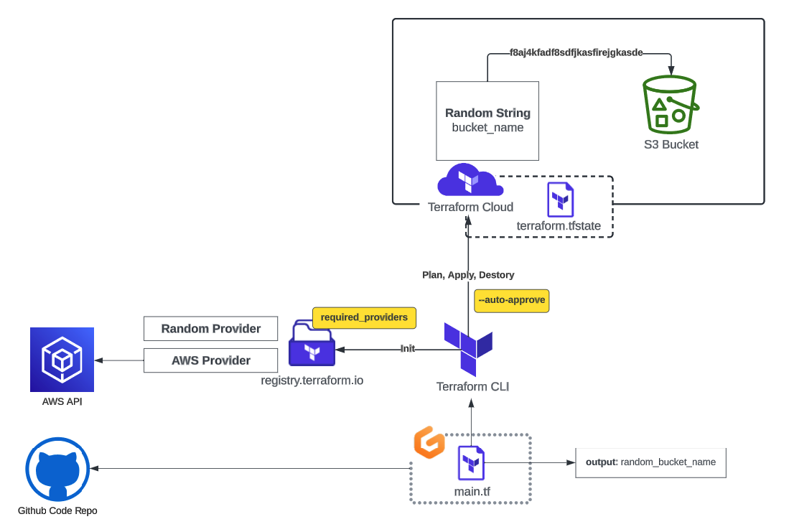

# Terraform Beginner Bootcamp 2023 - Week 0
https://github.com/omenking/terraform-beginner-bootcamp-2023



## Table of Contents
- [Semantic Versioning](#semantic-versioning)
- [Helpful Links](#helpful-links)
- [AWS](#aws)
- [Terraform Basics](#terraform-basics)
- [Terraform Cloud](#terraform-cloud-setup--issues)

## Semantic Versioning

This project is going to utilize semantic versioning for its tagging. [semver.org](https://semver.org/)

Given a version number **MAJOR.MINOR.PATCH** (eg. `1.0.1`), increment the:

- **MAJOR** version when you make incompatible API changes
- **MINOR** version when you add functionality in a backward compatible manner
- **PATCH** version when you make backward compatible bug fixes

Additional labels for pre-release and build metadata are available as extensions to the MAJOR.MINOR.PATCH format.

## Helpful Links
- https://developer.hashicorp.com/terraform/tutorials/aws-get-started/install-cli
- https://en.wikipedia.org/wiki/Shebang_(Unix)
- https://www.geeksforgeeks.org/chmod-command-linux/
- https://www.gitpod.io/docs/configure/workspaces/tasks

## AWS
### Test AWS Credentials
```sh
aws sts get-caller-idemntity
```
### AWS CLI env vars
https://docs.aws.amazon.com/cli/latest/userguide/cli-configure-envvars.html

## Terraform Basics

### Terraform Registry
https://registry.terraform.io/

Where you get providers and modules
### Terraform Steps
`Terraform Init`

> Initializes Terraform in your repo/downloads necessary files

`Terraform Plan`

> Preview planned changes

`Terrafrom Apply`

> Commit changes

`Terraform Destroy`

> Will destroy resources

## Terraform Cloud Setup / Issues
After you setup your account/project/workspace with the cloud provider, you need to setup a token for allowing remote access from gitpod/vscode.

Run `terraform init` it will ask if you want to migrate your state to the cloud. Select _yes_. It will launch a command line config utility. Select P for print to display the URL for the pagfe to create the token. Create a token, then past it in when prompted.